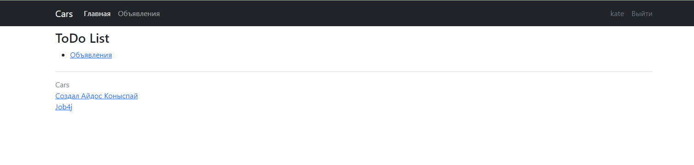
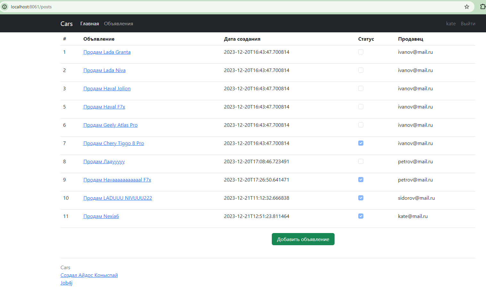
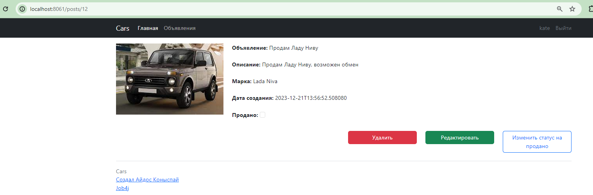
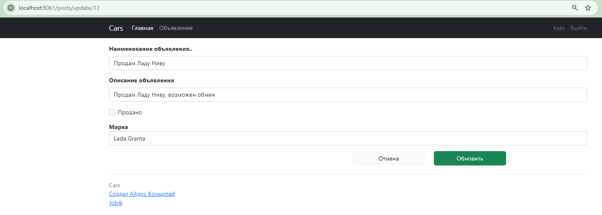
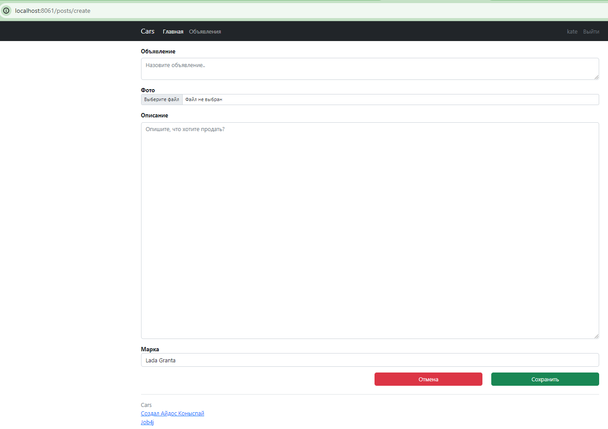
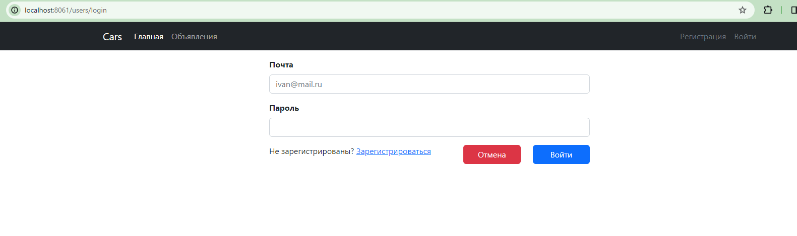
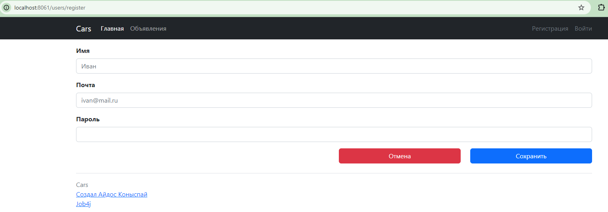

# Pet project "Cars"

## Описание проекта:

#### - Главная страница. Общую информация о ресурсе;

#### - Страница Объявлений. При выборе конкретного объявления пользователь переходит на страницу объявления;

#### - Страница регистрации;

#### - Страница вход;

## Стек технологий:
#### - Java 17, PostgreSQL 15.2, Liquibase, Maven, Mockito, Spring Boot, Thymeleaf, Hibernate

## Требования к окружению
#### - Java 17, Maven 4.0, PostgreSQL 15

## Запуск проекта

#### - Создание бд в СУБД

```sql
create
database cinema;
```
#### - Запуск миграционных файлов
 - 001_ddl_create_initial_schema.sql
 - 002_dml_insert_auto_users.sql
 - 003_ddl_create_price_history.sql
 - 004_ddl_create_participates.sql
 - 005_ddl_create_tables.sql
 - 006_dml_insert_into_tables.sql
 - 007_ddl_alter_table.sql
 - 008_ddl_create_photos_table.sql
 - 009_dml_alter_post_table.sql
 - 010_dml_alter_post_table.sql


## Взаимодействие с приложением
1) Главная страница
   

2. Объявления
   

3. Страница объявления
   

4. Обновление объявления
   

5. Создание объявления
   

6. Страница входа
   

7. Страница регистрации
   

## Контакты
#### - @urmoonfriend


